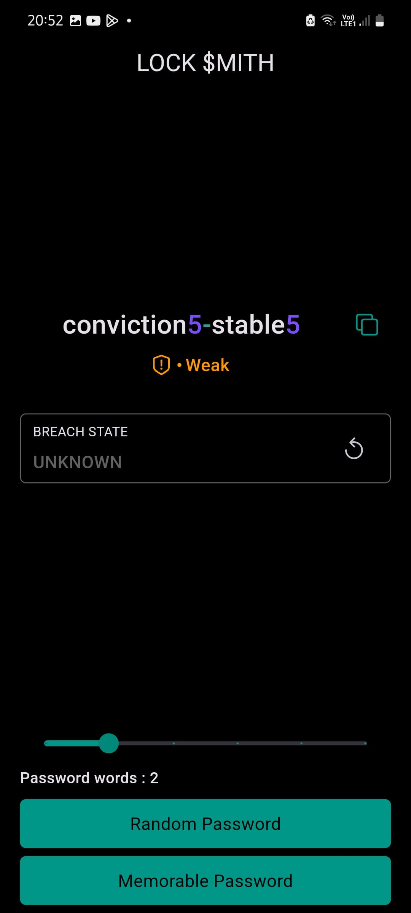
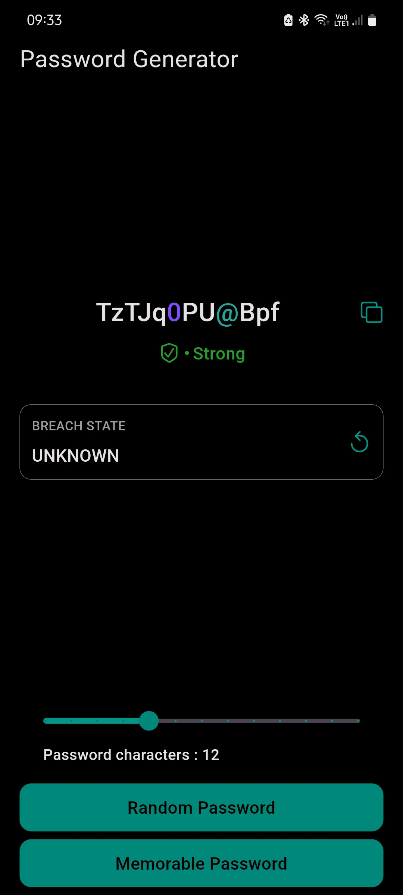

# Password Generator Checker

This is a password generator and checker app developed using Flutter. The app allows users to generate random or memorable passwords and check generated password for breach using haveIbeenpwned api.

### Features

- User-friendly interface: The app offers a clean and intuitive interface.
- Password generation: The app computes random or memorable password based on user input.
- Password strength: It uses zxcvbn to compute strength of password.
- Password copy: It allows users to copy generated password to clipboard.
- Password check: It checks password for breach via haveIbeenpwned api.

### Installation

#### Clone the repository using the following command:

```bash
git clone https://github.com/iamkartiknayak/Flutter_Password_Generator_Checker.git
```

#### Rename the project directory before running flutter commands

```bash
mv Flutter_Password_Generator_Checker password_gen_checker
```

#### Navigate to the project directory:

```bash
cd password_gen_checker
```

#### Install the dependencies:

```bash
flutter pub get
```

#### Run the application:

```bash
flutter run
```

### Usage

- Launch the application on your device/emulator.
- You will be presented with a screen with a copy button at the top beside the password, a slider, two buttons at bottom.
- Press on copy button to copy the generated password.
- Press on any one of the buttons at the bottom of screen to generate password.
- Move the slider to generate passwords of different number of words or length.

### Screenshots

&nbsp;&nbsp;&nbsp;
&nbsp;&nbsp;&nbsp;
<br><br>

### License

This project is licensed under the MIT License.

### Acknowledgements

The development of this app was made possible by the Flutter community's extensive resources. Special thanks to all those who contribute to the Flutter framework and its ecosystem.

Stay healthy and enjoy using the Password Generator Checker app!
