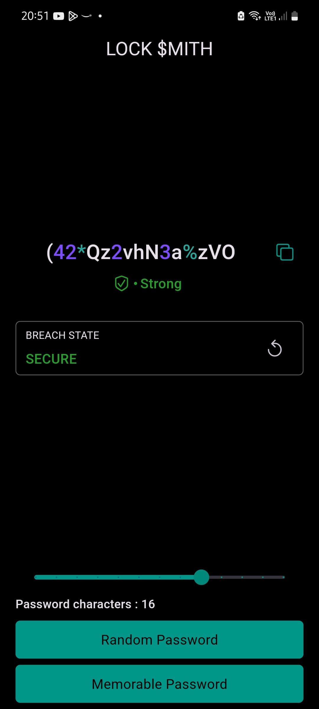

# Lock Smith

This is a password generator and checker app developed with Flutter. It enables users to create both random and memorable passwords and verify their security by checking against the haveIbeenpwned API for potential breaches.

### Features

- User-friendly Interface: The app features a clean and intuitive design, making it easy to use.
- Password Generation: Generates random or memorable passwords based on user preferences.
- Custom Passwords: Enables users to enter custom passwords for strength evaluation and breach checks.
- Password Strength: Utilizes the zxcvbn library to assess and provide feedback on password strength.
- Password Copy: Allows users to copy generated passwords directly to the clipboard.
- Password Check: Verifies passwords for potential breaches using the haveIbeenpwned API.

### Installation

#### Clone the repository using the following command:

```bash
git clone https://github.com/iamkartiknayak/lock-smith.git
```

#### Rename the project directory before running flutter commands

```bash
mv lock-smith lock_smith
```

#### Navigate to the project directory:

```bash
cd lock_smith
```

#### Install the dependencies:

```bash
flutter pub get
```

#### Run the application:

```bash
flutter run
```

### Usage

- Launch the application on your device/emulator.
- You will be presented with a screen with a copy button at the top beside the password, a slider, two buttons at bottom.
- Press on copy button to copy the generated password.
- Press on any one of the buttons at the bottom of screen to generate password.
- Move the slider to generate passwords of different number of words or length.

### Screenshots

&nbsp;&nbsp;&nbsp;
&nbsp;&nbsp;&nbsp;
<br><br>

### License

This project is licensed under the MIT License.

### Acknowledgements

The development of this app was made possible by the Flutter community's extensive resources. Special thanks to all those who contribute to the Flutter framework and its ecosystem.

Stay healthy and enjoy using the Lock Smith app!
